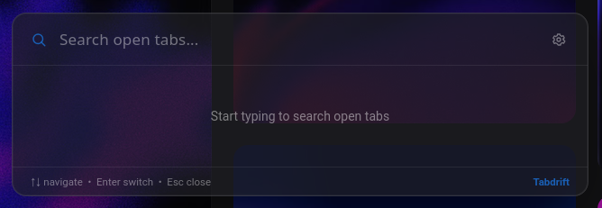

# Tabdrift



A fast, keyboard-first tab switcher for Firefox. Press a shortcut, type a
few letters, jump straight to the tab you meant.

## What it does

Tabdrift opens a floating search overlay over whatever page you're on.
It filters your open tabs by title or URL as you type, across every
window, and switches to the one you pick with the arrow keys and enter.

Default shortcut: `Alt+Shift+K`. Shortcut, overlay position, and accent
color are all configurable from the settings page.

[](https://addons.mozilla.org/firefox/addon/tabdrift/)

## Install

Click the badge above once the listing is live, or install from source:

```sh
npm install
npm run dev:firefox
```

This opens a temporary Firefox profile with the extension already loaded.

## Development

| Script                  | What it does                               |
| ----------------------- | ------------------------------------------ |
| `npm run dev`           | Run in a dev browser (Chromium by default) |
| `npm run dev:firefox`   | Run in a dev Firefox profile               |
| `npm run build`         | Production build                           |
| `npm run build:firefox` | Production build targeting Firefox         |
| `npm run zip:firefox`   | Build and package as a submittable `.zip`  |
| `npm run compile`       | Type-check without emitting                |
| `npm run lint`          | Lint with Biome                            |
| `npm run lint:fix`      | Lint and auto-fix with Biome               |

### Releasing a new version

```sh
npm version patch   # or minor / major
```

## Project layout

- `entrypoints/`, background script, the injected overlay, and the
  settings page
- `lib/`, shared settings storage and helpers
- `public/icons/`, extension icons
- `site/`, the standalone marketing page (deployable as-is to Netlify
  or any static host)

## License

[MIT](./LICENSE)
